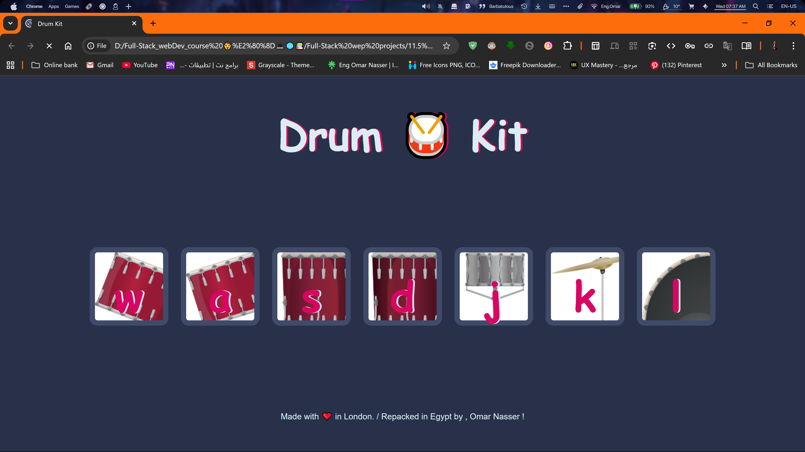

# 🥁 Drum Kit  


An interactive web-based drum kit that plays sounds when you click the on-screen buttons or press the corresponding keys on your keyboard. This project demonstrates DOM manipulation and event handling using **HTML**, **CSS**, and **vanilla JavaScript**.

<div align="center">
  
</div>

---

## 📐 Features

- ✅ 7 different drum sounds, each mapped to a unique button.
- 🖱️ **Mouse Support:** Click any button to play the corresponding drum sound.
- ⌨️ **Keyboard Support:** Press the associated key (`w`, `a`, `s`, `d`, `j`, `k`, `l`) for a more tactile experience.
- ✨ **Visual Feedback:** Buttons animate when triggered, providing a clear visual cue.
- 🔊 **Real-time Audio:** Instant sound playback on interaction.
- 🚀 **Vanilla JavaScript:** Built purely with native browser technologies without any libraries or frameworks.

---

## 📂 Project Structure

```bash
drum-kit-project/
│
├── images/
│   ├── tom1.png, tom2.png, ...
│   └── snare.png, crash.png, kick.png
│
├── sounds/
│   ├── tom-1.mp3, tom-2.mp3, ...
│   └── snare.mp3, crash.mp3, kick-bass.mp3
│
├── screenshots/
│   └── screenshot.png
│
├── index.html            # Main page structure
├── styles.css            # Styling for the page
├── index.js              # Event handling & logic (Vanilla JS)
└── README.md             # You're here!
```

---

## 🛠 How to Use

1.  Clone the repository or download the files.
    ```bash
    git clone https://github.com/Omar-eng-sys/Drum-Kit.git
    cd drum-kit-project
    ```

2.  Open the **`index.html`** file in your favorite web browser.

3.  **Play the drums!** You can either:
    - Click on the buttons on the screen.
    - Press the corresponding keys on your keyboard (`w`, `a`, `s`, `d`, `j`, `k`, `l`).

---

## 📌 Future Improvements

- [ ] Add a recording feature to allow users to create and play back their own beats.
- [ ] Implement a "metronome" to help with timing.
- [ ] Allow users to switch between different drum kits (e.g., electronic, acoustic).
- [ ] Create a visualizer that reacts to the sounds being played.

---

## 🙌 Credits

- 👨‍💻 Development & Logic: [**Eng Omar Nasser**]  
- 🎓 Core Project Idea: Based on a challenge from **The App Brewery**.  
- 🛠 Tools Used: HTML5, CSS3, Vanilla JavaScript.  
